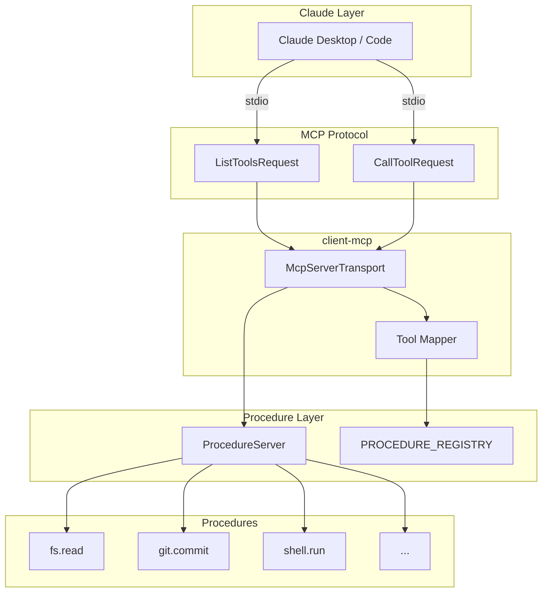
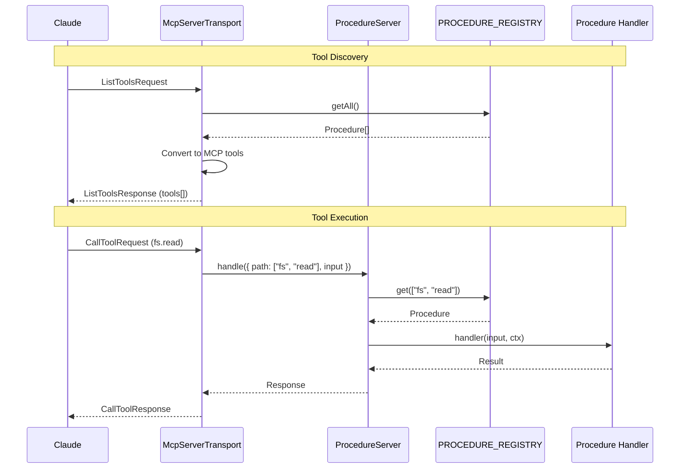
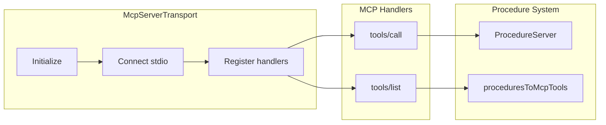
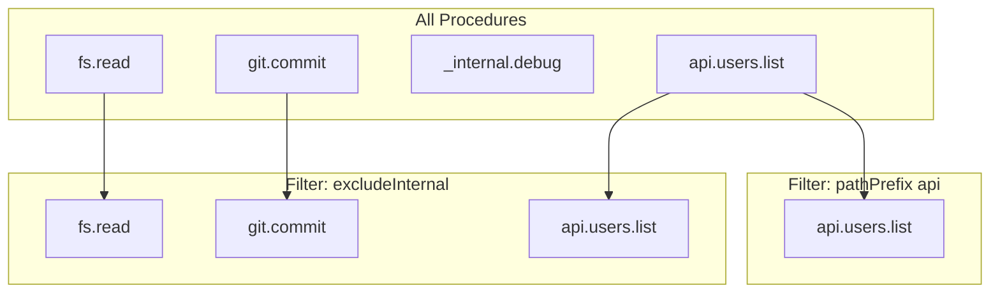
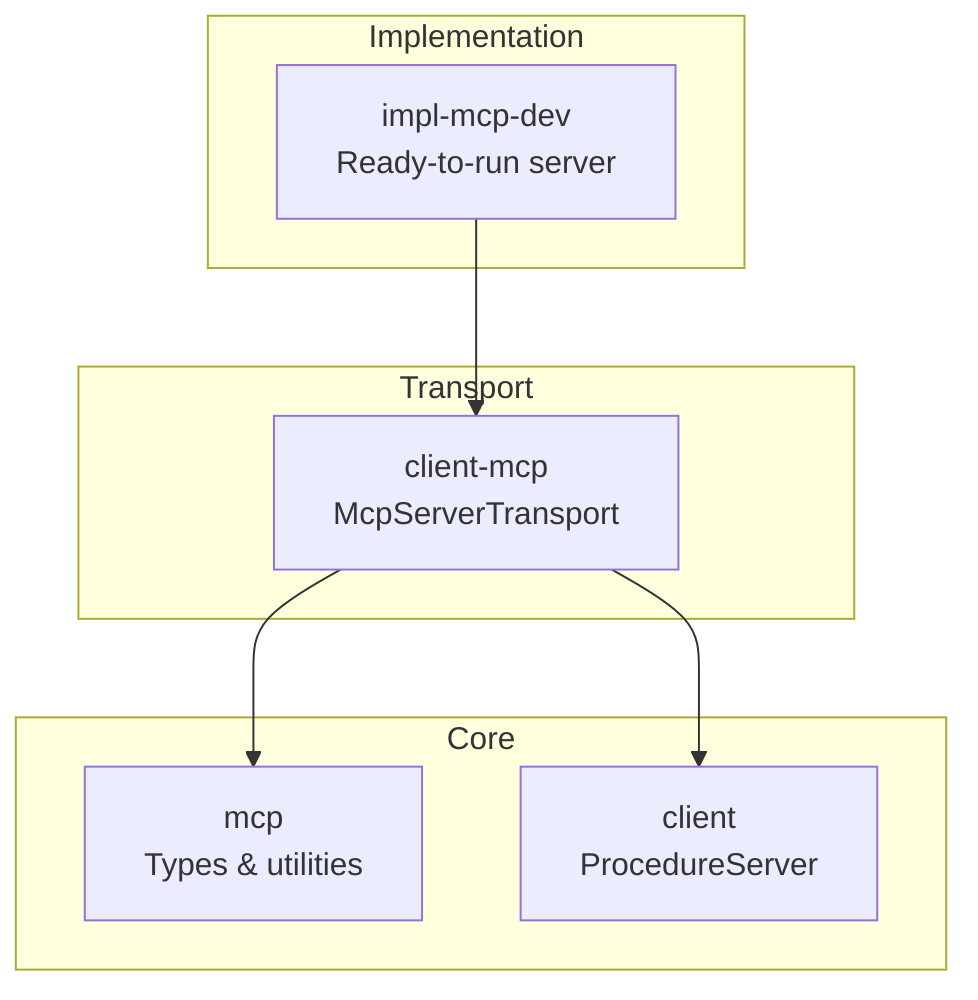

# @mark1russell7/client-mcp

[](https://opensource.org/licenses/MIT)
[](https://www.typescriptlang.org/)
[](https://nodejs.org/)
[](https://modelcontextprotocol.io/)

> MCP server transport for the procedure system. Exposes procedures as MCP tools for Claude integration.

## Table of Contents

- [Overview](#overview)
- [Installation](#installation)
- [Architecture](#architecture)
- [Quick Start](#quick-start)
- [API Reference](#api-reference)
- [Tool Filtering](#tool-filtering)
- [Claude Desktop Setup](#claude-desktop-setup)
- [Integration](#integration)
- [Requirements](#requirements)
- [License](#license)

---

## Overview

**client-mcp** bridges the procedure system with MCP (Model Context Protocol):

- **Transport Layer** - Connects `ProcedureServer` to Claude via stdio
- **Dynamic Registration** - Automatically refreshes tools when procedures change
- **Tool Filtering** - Control which procedures are exposed as MCP tools
- **Debug Mode** - Logging for troubleshooting MCP connections

---

## Installation

```bash
npm install @mark1russell7/client-mcp
```

---

## Architecture

### System Overview



### Request Flow



### Transport Architecture



---

## Quick Start

```typescript
import { ProcedureServer, PROCEDURE_REGISTRY } from "@mark1russell7/client";
import { McpServerTransport } from "@mark1russell7/client-mcp";

// Load procedures (via side-effect imports)
import "@mark1russell7/bundle-dev/register.js";

// Create procedure server
const server = new ProcedureServer({
  autoRegister: true,
  registry: PROCEDURE_REGISTRY,
});

// Create MCP transport
const mcp = new McpServerTransport(server, {
  transport: "stdio",
  serverInfo: { name: "my-server", version: "1.0.0" },
});

// Add transport and start
server.addTransport(mcp);
await server.start();
```

---

## API Reference

### McpServerTransport

Main transport class for MCP integration.

```typescript
interface McpServerTransportOptions {
  transport: "stdio" | "sse";      // Transport type
  serverInfo: {
    name: string;                   // Server name
    version: string;                // Server version
  };
  filter?: McpToolFilter;           // Tool filtering options
  debug?: boolean;                  // Enable debug logging
}

class McpServerTransport {
  constructor(server: ProcedureServer, options: McpServerTransportOptions);

  // Get current transport state
  getState(): {
    connected: boolean;
    toolCount: number;
    lastRefresh: Date;
  };

  // Close the transport
  close(): Promise<void>;
}
```

### Built-in Procedures

| Path | Description |
|------|-------------|
| `mcp.serve` | Start MCP server programmatically |
| `mcp.list-tools` | List available MCP tools with filtering |

---

## Tool Filtering

Control which procedures are exposed as MCP tools:

```typescript
interface McpToolFilter {
  includeTags?: string[];      // Only include these tags
  excludeTags?: string[];      // Exclude these tags
  excludeInternal?: boolean;   // Exclude internal procedures
  pathPrefix?: string[];       // Only include procedures with this prefix
}

const mcp = new McpServerTransport(server, {
  transport: "stdio",
  filter: {
    includeTags: ["public"],
    excludeInternal: true,
    pathPrefix: ["api"],
  },
});
```

### Filtering Examples



---

## Claude Desktop Setup

### Configuration File Locations

**Windows:** `%APPDATA%\Claude\claude_desktop_config.json`
**macOS:** `~/Library/Application Support/Claude/claude_desktop_config.json`

### Basic Configuration

```json
{
  "mcpServers": {
    "my-server": {
      "command": "npx",
      "args": ["@mark1russell7/impl-mcp-dev"]
    }
  }
}
```

### With Custom Bundle

```json
{
  "mcpServers": {
    "dev-tools": {
      "command": "node",
      "args": ["C:/Users/me/git/impl-mcp-dev/dist/server.js"],
      "env": {
        "MCP_BUNDLES": "@mark1russell7/bundle-mcp",
        "MCP_DEBUG": "true"
      }
    }
  }
}
```

---

## Integration

### Dynamic Tool Registration

The transport automatically refreshes MCP tools when procedures are registered or unregistered:

```typescript
// Tools are automatically updated when procedures change
PROCEDURE_REGISTRY.register(newProcedure);  // → MCP tools refresh
PROCEDURE_REGISTRY.unregister(oldPath);     // → MCP tools refresh
```

### Debug Mode

Enable debug logging for troubleshooting:

```typescript
const mcp = new McpServerTransport(server, {
  transport: "stdio",
  debug: true,  // Logs to stderr
});
```

### With Other Packages



---

## Requirements

- **Node.js** >= 20
- **Dependencies:**
  - `@mark1russell7/client`
  - `@mark1russell7/mcp`
  - `@modelcontextprotocol/sdk`

---

## License

MIT
